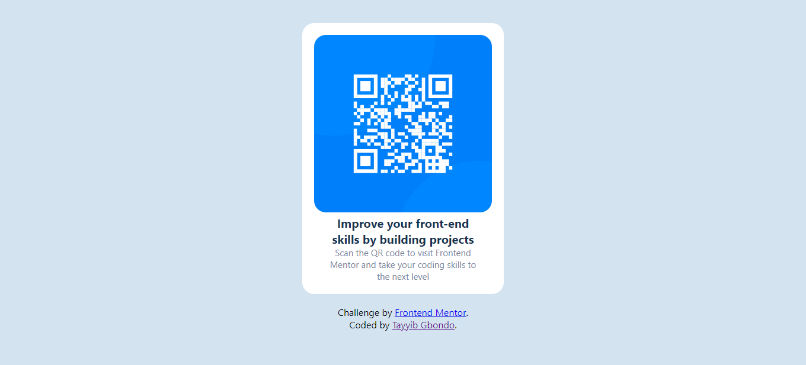

# Frontend Mentor - QR code component solution

This is a solution to the [QR code component challenge on Frontend Mentor](https://qrcode-tayyib.netlify.app/).

Frontend Mentor challenges help you improve your coding skills by building realistic projects.

## Screenshot

**Here are the screen display size of my solution**

### Links

- Solution URL: [Source code](https://github.com/tayyibGbondo/QR-Code-Component)
- Live Site URL: [View Live](https://qrcode-tayyib.netlify.app/)

## My process

### Built with

- Semantic HTML5 markup
- CSS custom properties
- Flexbox
- Chrome

### What I learned

This challenge give me the ability to reflect back on my responsive design knowledge with my custom css and it was pretty easier to complete and achieve what was required of me.
looking faward for more challenges from [frontend mentor](https://www.frontendmentor.io?ref=challenge).

### Continued development

Looking forward for more challenged that get my brain cracked.

## Author

\*_Please follow me_:\*

- Website - [Tayyib Gbondo](https://github.com/tayyibGbondo)
- Frontend Mentor - [@tayyibGbondo](https://www.frontendmentor.io/profile/tayyibGbondo)
- Twitter - [@TahibGbondo](https://www.twitter.com/TahibGbondo)
